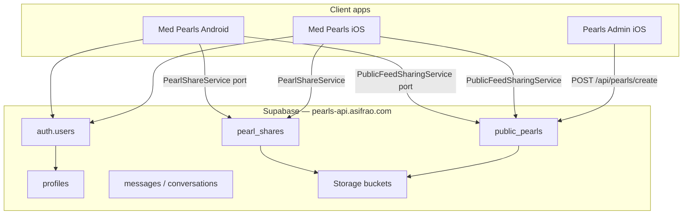

# Med Pearls — Android Parity Plan

> **Goal:** Replicate the iOS app ([Knowledge Pearls](../Knowledge%20Pearls)) in this folder with the same design, layout, colour scheme, tabs, settings, custom pop-ups, and Supabase backend.
>
> **Status:** Stage 3 complete — Stage 4 next  
> **Last updated:** 2026-06-26  
> **iOS reference:** `/Users/m4-mac/Documents/Xcode-projects/Knowledge Pearls`  
> **Admin reference:** `/Users/m4-mac/Documents/Xcode-projects/Pearls-Admin`  
> **Dev workflow:** This folder syncs to your MacBook where Android Studio runs (not built on this Mac).

---

## Progress summary

| Stage | Name | Status |
|-------|------|--------|
| 0 | Planning & decisions | ✅ Complete |
| 1 | Project scaffold & design tokens | ✅ Complete |
| 2 | Core UI shell (splash, tabs, headers) | ✅ Complete |
| 3 | Local data layer + sync hooks | ✅ Complete |
| 4 | Auth, profile & sync services | ⬜ Not started |
| 5 | My Feed & pearl detail | ⬜ Not started |
| 6 | Capture flows | ⬜ Not started |
| 7 | Folders & Favourites | ⬜ Not started |
| 8 | Public Feed (read + submit) | ⬜ Not started |
| 9 | Messaging & pearl shares (cross-platform) | ⬜ Not started |
| 10 | Settings & sub-screens | ⬜ Not started |
| 11 | Custom alerts, toasts & overlays | ⬜ Not started |
| 12 | Backup, cache & offline | ⬜ Not started |
| 13 | Push, deep links & share target | ⬜ Not started |
| 14 | Polish, QA & release | ⬜ Not started |

---

## 1. iOS app audit (source of truth)

### 1.1 Product identity

| Item | iOS value |
|------|-----------|
| Display name | **Med Pearls** |
| Bundle ID | `com.knowledgepearls.app` |
| Min OS | iOS 18 |
| Default UI style | Dark (user can override via Appearance settings) |
| Portrait + landscape | Supported |

### 1.2 Navigation model

Four persistent tab roots (opacity cross-fade, state preserved) plus overlays:

| Tab | Theme colours (primary → secondary) | Notes |
|-----|-------------------------------------|-------|
| **My Feed** | Indigo `#6C5CE7` → Violet-blue `#4F6EF7` | Search, tag filter, content-type picker, inbox, capture menu |
| **Folders** | Amber `#F4A640` → Orange `#FF8A3D` | Floating card menu (not a full screen); opens folder contents as full-screen |
| **Public Feed** (centre) | Teal `#14B8A6` → Cyan `#22D3EE` | New/Seen section pills above tab bar; badge for new count |
| **Favourites** | Rose `#EC407A` → Coral `#FF6B8B` | Filtered local pearls |
| **Settings** | Slate `#7C8696` → Steel `#5B6B82` | Sheet (not tab bar item); opened from header gear |

**Custom tab bar:** Glass capsule (`LiquidTabBar`), 58pt height, 10pt bottom padding, gradient pill indicator on selected tab, spring animations.

### 1.3 Design system (must match pixel-philosophy)

| iOS component | Location | Android target |
|---------------|----------|----------------|
| `PearlSurfaceColors` | Theme | Compose `ColorScheme` + semantic tokens |
| `LiquidBackground` | Theme | Animated blurred gradient blobs per tab |
| `LiquidTabBar` | Theme | Custom bottom bar (not Material `NavigationBar`) |
| `TabScreenHeader` | Theme | Fixed glass header, 52pt content height |
| `AdaptiveGlass` / `GlassFill` | Theme | `BlurredEdgeTreatment` / custom draw |
| `FloatingCardSwipeDismiss` | Theme | Swipe-to-dismiss sheets & folder menu |
| `OfflineConnectivityUI` | Theme | Full-screen no-internet overlay |
| `BackendConnectivityUI` | Theme | Backend-down overlay + restored toast |
| Launch splash | `ContentView` | Animated ring of medical icons, progress bar |

**Surface palette (dark / light):**

- Canvas: `#06060A` / `#F4F5F9`
- Card border: white 10% / black 8%
- Scrim, dividers, muted tiles — all defined in `PearlSurfaceColors.swift`

### 1.4 Feature inventory (~146 Swift UI files)

#### Local-first (SwiftData + CloudKit on iOS)

- `KnowledgePearl` — standard + clinical case, tags, media, folders, favourites
- `Folder`, `PearlMedia`, `ClinicalCasePayload`
- Auto-tagging engine, backup/restore JSON, device cache

#### Supabase-backed (shared backend)

| Feature | iOS service | Backend |
|---------|-------------|---------|
| Auth (email, Google, Apple) | `AccountViewModel`, `SupabaseManager` | GoTrue @ `https://pearls-api.asifrao.com` |
| User profiles | `ProfileViewModel` | `profiles` table + storage |
| Public feed browse/submit | `PublicFeedService` | `public_pearls`, moderation |
| Comments | `CommentService` | `public_pearl_comments` |
| Likes | `LikeService` | `public_pearl_likes` + RPC |
| Direct messaging | `MessagingService` | conversations, messages |
| Pearl shares (friend) | `PearlShareService` | `pearl_shares` + storage RLS |
| Push notifications | `PushNotificationService` | FCM/APNs via edge functions |
| Analytics | `AnalyticsService` | `functions/v1/analytics-ingest` |
| Account deletion | Settings | `functions/v1/delete-account` |

**Supabase config (from iOS — publishable key is safe to embed):**

```
URL:     https://pearls-api.asifrao.com
Anon key: (see SupabaseManager.swift)
Auth redirect (iOS): com.knowledgepearls.app://login-callback
Support email: admin@hormonology.uk
```

#### Custom pop-ups & toasts (dedicated UI, not system alerts)

- `PearlDeleteConfirmationAlert`
- `PearlActionSuccessAlert`
- `FeedEmptyFilterAlert`
- `SharedPearlIntroAlert` / `Submit` / `SubmissionSuccess`
- `CacheClearedSuccessAlert`
- `NoInternetConnectionAlert` / `BackendUnavailableAlert`
- `BackendRestoredToast`, `SeenToastView`
- `PearlShareReceivedToast`, `FriendShareSentToast`
- `AirDropShareWarningAlert` (iOS-only — see §4)

#### Settings sections

1. Account (sign in/out, profile card)
2. Community (pending submissions)
3. Appearance (System / Light / Dark)
4. Data & Sync (backup/restore, device cache, **iCloud** on iOS)
5. Privacy
6. About (creator bio, version)
7. Information governance notice

---

## 2. Recommended Android stack

| Layer | Choice | Rationale |
|-------|--------|-----------|
| Language | **Kotlin 2.x** | Standard for Android; matches Swift ergonomics |
| UI | **Jetpack Compose** | Closest to SwiftUI declarative model |
| Architecture | **MVVM + Repository** | Mirrors iOS ViewModel + Service pattern |
| DI | **Hilt** | Lifecycle-safe singletons (`SupabaseManager` equivalent) |
| Local DB | **Room** | Replaces SwiftData; supports relations & migrations |
| Networking | **supabase-kt** + **Ktor** | Official Kotlin SDK for same backend |
| Images | **Coil 3** | Thumbnails, link previews, avatars |
| Video | **Media3 (ExoPlayer)** | Pearl video attachments |
| Background | **WorkManager** | Scheduled backup analogue |
| Push | **Firebase Cloud Messaging** | Supabase push uses FCM on Android |
| Crash reporting | **Sentry Android** | iOS already uses Sentry |
| Serialization | **kotlinx.serialization** | JSON backup payloads, clinical case |

**Min SDK recommendation:** API 26 (Android 8.0) — wide device coverage; glass/blur may need API 31+ fallback with semi-opaque surfaces on older devices.

**Package name recommendation:** `com.knowledgepearls.app` (same as iOS for deep links & OAuth consistency).

---

## 3. Target architecture

```
app/
├── ui/
│   ├── theme/          # PearlSurfaceColors, TabTheme, LiquidBackground, TabBar
│   ├── components/     # Headers, cards, alerts, toasts, glass primitives
│   ├── navigation/     # Main scaffold, tab state, sheet routes
│   └── features/       # feed, favourites, publicfeed, folders, capture, settings, …
├── domain/             # Use cases (optional thin layer)
├── data/
│   ├── local/          # Room entities, DAOs, KnowledgePearl repository
│   ├── remote/         # Supabase services (mirror iOS *Service.swift)
│   └── backup/         # Export/import JSON (PearlsKit BackupPayload parity)
└── di/                 # Hilt modules
```

**State preservation:** Use `rememberSaveable` + separate `NavHost` back stacks per tab (same pattern as iOS keeping three tab roots alive).

---

## 4. Cross-platform sync architecture (target state)

**Core principle:** Supabase is the single shared backend. iOS and Android are thin clients — they do not talk to each other directly. Any pearl or message written to Supabase by one platform is visible to the other, subject to RLS (Row Level Security).



### 4.1 Three data tiers

| Tier | What | Cross-platform? | How |
|------|------|-----------------|-----|
| **A — Community (server)** | Public feed, comments, likes, profiles, messaging, pearl shares | ✅ **Yes — automatic** | Same Supabase tables + RLS on both apps |
| **B — Owned public pearls → My Feed** | Pearls you (or admin as creator) published | ✅ **Yes — sync on foreground** | `OwnedPublicPearlSync` + `PublicFeedStatusSync` (port to Android) |
| **C — Private local pearls** | Drafts, folders, never-shared pearls | ⚠️ **Per-device today** | iOS: CloudKit. Android: Room only. Optional future: Supabase private-pearl table |

### 4.2 Public posts — already designed for cross-platform

When a pearl is published (from **any** source), it lands in `public_pearls`. Both apps read the same feed.

| Source | Flow | Appears on Android Public Feed? |
|--------|------|--------------------------------|
| **Pearls Admin** | `POST /api/pearls/create` → `status: approved` immediately (`ingestion_source: admin_capture`) | ✅ Yes — no app work beyond implementing `PublicFeedService` |
| **iOS user submit** | `PublicFeedSharingService` → `status: pending` → admin approves → `approved` | ✅ Yes |
| **Android user submit** | Same service port (Stage 8) | ✅ Yes — iOS sees it too |
| **Twitter scraper** | CT 107 ingest → moderation in Admin | ✅ Yes |

**Android must implement:**

- `PublicFeedService` — paginated read of `public_pearls` where `status = approved`
- `PublicFeedSharingService` — upload media + insert row (Stage 8 — public submit)
- `PublicFeedStatusSync` — refresh local moderation badges after approval/rejection
- `OwnedPublicPearlSync` — import your approved server pearls into local My Feed (matches iOS behaviour for creator account)

**No new backend tables required** for public cross-platform sync.

### 4.3 Pearl sharing between users — cross-platform by design

Friend pearl sharing uses `pearl_shares` with platform-agnostic UUIDs:

- **Sender** (iOS or Android) → inserts row with `pearl_payload` JSONB + media in storage
- **Recipient** (any platform) → inbox query by `recipient_id = auth.uid()`, accept → import to local Room DB
- **User search** → `search_profiles_for_share` RPC (same user directory for all clients)
- **Safety** → RLS: senders read own outbound; recipients read/respond to inbound only; `allow_pearl_shares` profile flag

An iOS user can share to an Android user (and vice versa) as long as both use the **same Supabase account** (email or Google). There is one `auth.users` table — not separate iOS/Android user DBs.

**Android must implement (Stage 9):** full `PearlShareService` port, inbox UI, push on receive (Stage 13).

### 4.4 Admin console (Pearls-Admin)

Reference: `/Users/m4-mac/Documents/Xcode-projects/Pearls-Admin`

- Admin publishes via `AdminPearlCreateService` → Express API → `public_pearls`
- Pearls are attributed to `CREATOR_USER_ID` (creator/bot account)
- Auto-approved — visible in Public Feed on all clients instantly after Android implements feed read

If you sign into Med Pearls on Android with the **creator account**, `OwnedPublicPearlSync` also pulls those pearls into **My Feed** (same as iOS).

### 4.5 What stays device-local (unless we extend later)

| Data | iOS today | Android plan | Future option |
|------|-----------|--------------|---------------|
| Unshared private pearls | SwiftData + CloudKit | Room only | Supabase `user_pearls` table + sync engine |
| Folder organisation | Local | Local | Could sync via backup or future server table |
| Favourites flag | Local | Local | Trivial to add to future sync |
| Seen/New public feed state | Local prefs | Local prefs | Per-device UX (intentional) |

### 4.6 Sync triggers (mirror iOS `ContentView`)

Run on Android app foreground + after sign-in:

1. `PublicFeedStatusSync.syncLocalPearls(userId)` — update moderation status on local pearls
2. `OwnedPublicPearlSync.importMissingOwnedPearls(userId)` — pull approved server pearls into My Feed
3. `MessagingUnreadStore.refresh(userId)` — inbox badge
4. Public feed list refresh — pull latest `public_pearls` page

---

## 5. Platform decisions — confirmed

| # | Topic | Decision |
|---|-------|----------|
| Q1 | **Pearl / public sync** | ✅ **Build Supabase sync now** — public posts and admin publishes appear on both platforms via shared `public_pearls` |
| Q2 | **Sign-in** | ✅ **Google + Email** |
| Q3 | **Import** | ✅ **Share intent + file picker** (replaces AirDrop) |
| Q4 | **Share target** | ✅ **Include in v1** (`ACTION_SEND`) |
| Q5 | **App name** | ✅ **Med Pearls** |
| Q5b | **Package name** | ✅ `com.knowledgepearls.app` (default — same OAuth/deep links as iOS) |
| Q6 | **Min SDK** | ✅ **API 26** |
| Q7 | **MVP scope** | ✅ Stages 1–5 first; **public submit in Stage 8** (not MVP) |
| Q8 | **Firebase / Play Console** | ✅ **Create new projects** — documented in Stage 13; setup done on MacBook |
| Q9 | **Design review** | Use iOS Simulator captures during development |
| Q10 | **Timeline** | ✅ No hard deadline |
| Q11 | **Cross-platform sharing** | ✅ Same Supabase users + `pearl_shares` — iOS ↔ Android friend share required (Stage 9) |

---

## 6. Supabase integration plan

**No backend changes required** for cross-platform public feed or pearl sharing — reuse existing project at `pearls-api.asifrao.com`.

### 6.1 Android setup tasks

- [ ] Add `com.knowledgepearls.app://login-callback` Android OAuth redirect in Supabase Auth
- [ ] Create Firebase project + `google-services.json` on MacBook (Stage 13 checklist)
- [ ] Mirror iOS `SupabaseDateDecoder` timestamp handling in Kotlin
- [ ] Port service classes (sync services are **P0**, not optional):

| Priority | Service | iOS file | Cross-platform role |
|----------|---------|----------|---------------------|
| P0 | Supabase client singleton | `SupabaseManager.swift` | Shared backend connection |
| P0 | Account / session | `AccountViewModel.swift` | Same `auth.users` on both platforms |
| P0 | Public feed read | `PublicFeedService.swift` | Admin + iOS posts → Android feed |
| P0 | Public feed status sync | `PublicFeedStatusSync.swift` | Moderation state on local pearls |
| P0 | Owned pearl import | `OwnedPublicPearlSync.swift` | Creator/admin pearls → My Feed |
| P0 | Public feed submit | `PublicFeedSharingService.swift` | Android posts → iOS feed (Stage 8) |
| P1 | Pearl shares | `PearlShareService.swift` | iOS ↔ Android friend sharing |
| P1 | Messaging | `MessagingService.swift` | Cross-platform inbox |
| P1 | Comments | `CommentService.swift` | Shared engagement |
| P1 | Likes | `LikeService.swift` | Shared engagement |
| P2 | Analytics | `AnalyticsService.swift` | Admin dashboard |
| P2 | Push | `PushNotificationService.swift` | Share/message notifications |
| P2 | Backend health | `BackendHealthMonitor.swift` | Offline UX |

### 6.2 Storage buckets (from migrations)

Mirror iOS upload paths and RLS policies for: avatars, public pearl media, friend-share attachments.

### 6.3 Security model (already in place — do not weaken)

- All community tables use **RLS** — clients only see rows they own or are allowed to read
- Pearl share media uses storage RLS (`0023_friend_share_storage_rls.sql`)
- Profile search is `security definer` RPC with rate limiting — port exact query params
- **Never** embed service-role key in the Android app — anon key + user JWT only

### 6.4 Analytics — platform segmentation (Android vs iOS)

The shared `analytics-ingest` edge function stores a `platform` field on every event and presence row.

| Client | `platform` value | iOS reference |
|--------|------------------|---------------|
| Med Pearls iOS (phone) | `ios` | `AnalyticsService.swift` |
| Med Pearls iOS (iPad) | `ipados` | same |
| **Med Pearls Android** | **`android`** | `AnalyticsPlatform.VALUE` in `AppBrand.kt` |

**Android app (Stage P2 — analytics port):**

- [ ] Send `platform: "android"` on every `analytics-ingest` batch (mirror iOS body shape)
- [ ] Send `platform: "android"` on push token registration (mirror `PushNotificationService`)
- [ ] Include `app_version` from `BuildConfig.VERSION_NAME`

**Pearls Admin dashboard (later — separate repo):**

- [ ] Update `server/routes-analytics.js` `deviceBreakdown` to include `android`:
  ```js
  breakdownByField(allEvents, 'platform', ['ios', 'ipados', 'android'])
  ```
- [ ] Analytics UI: show Android slice in device chart + filter by platform
- [ ] Presence / DAU metrics: segment by `android` vs `ios` / `ipados`

No database migration required — `platform` is already `text` on `app_analytics_events` and `app_presence`.

---

## 7. Design parity checklist

Use this when reviewing each screen against iOS Simulator screenshots.

### Global

- [ ] Liquid gradient background per tab theme
- [ ] Glass tab bar with centre Public Feed emphasis
- [ ] Tab header: accent bar, 24pt semibold title, 10pt uppercase subtitle
- [ ] Settings gear in header (all tabs except Settings sheet)
- [ ] Launch splash animation (ring + progress + tagline)
- [ ] Offline + backend health overlays
- [ ] Light / dark / system appearance

### Components

- [ ] `PearlCard` layout (media strip, tags, swipe actions)
- [ ] `PublicFeedCard` + New/Seen pills
- [ ] `GlowingAddButton` + capture options menu
- [ ] Folder floating menu (swipe dismiss, scrim)
- [ ] All custom alerts listed in §1.4
- [ ] Inbox unread reminder chip
- [ ] Profile avatar (rounded rect, gradient border)

### Spacing tokens (from iOS)

| Token | Value |
|-------|-------|
| Tab bar height | 58dp |
| Screen bottom padding | 10dp |
| Horizontal screen padding | 20dp |
| Card corner radius | 18dp |
| Header content height | 52dp |
| Header action button | 36dp |

---

## 8. Phased implementation

### Stage 1 — Project scaffold & design tokens ✅

**Deliverables**

- [x] Android Studio project: `MedPearls`, package `com.knowledgepearls.app`
- [x] Compose BOM, Hilt, Room, supabase-kt, Coil dependencies in version catalog
- [x] `PearlColors.kt` — full `PearlSurfaceColors` port
- [x] `TabTheme.kt` — jewel-tone tab identities
- [x] `LiquidBackground.kt` — animated blobs (blur API 31+, fallback API 26–30)
- [x] `PearlTypography`, `MedPearlsTheme`, `AppearanceMode`
- [x] `PearlLayout` spacing tokens
- [x] `AnalyticsPlatform.VALUE = "android"` constant for future analytics port
- [x] Placeholder adaptive icon (replace with iOS AppLogo export on MacBook)
- [x] `.gitignore`, `README.md`, Gradle wrapper
- [ ] Asset import: app icon, creator portrait, logo from iOS `Assets.xcassets` *(on MacBook)*

**Design philosophy:** iOS visual language (liquid glass, jewel tabs, rounded type hierarchy) with Android platform affordances (edge-to-edge, predictive back, Material motion only where it doesn't fight the iOS layout).

**iOS reference files:** `PearlSurfaceColors.swift`, `TabTheme.swift`, `LiquidBackground.swift`, `AppBrand.swift`

---

### Stage 2 — Core UI shell

**Deliverables**

- [ ] `MainScaffold` with tab state machine (feed / folders menu / public / favourites)
- [ ] `LiquidTabBar` composable
- [ ] `TabScreenHeader` composable
- [ ] `LaunchSplashScreen`
- [ ] Settings sheet route
- [ ] Placeholder tab screens with correct backgrounds

**iOS reference:** `ContentView.swift`, `LiquidTabBar.swift`, `TabScreenHeader.swift`

---

### Stage 3 — Local data layer + sync hooks

**Deliverables**

- [x] Room entities: `KnowledgePearl`, `PearlMedia`, `Folder`
- [x] DAOs + `KnowledgePearlRepository`
- [x] Clinical case JSON column (`ClinicalCasePayload` parity)
- [x] `publicPearlID`, `publicPearlStatus`, `isSharedPublicly` columns (for sync)
- [x] Sample data for previews
- [x] Stub sync runners callable from `MainActivity` lifecycle

**iOS reference:** `PearlsKit/Models/*`, `OwnedPublicPearlSync.swift`, `PublicFeedStatusSync.swift`

---

### Stage 4 — Auth, profile & sync services

**Deliverables**

- [ ] `SupabaseModule` (Hilt)
- [ ] Email sign-up / sign-in / verification UI
- [ ] Google Sign-In (Credential Manager)
- [ ] `AuthView` hero layout + success animation
- [ ] `ProfileSetupView` gate after first sign-in
- [ ] `UserProfileView` / `EditProfileView`
- [ ] Avatar upload to Supabase Storage
- [ ] **`PublicFeedStatusSync` port** — runs on sign-in + foreground
- [ ] **`OwnedPublicPearlSync` port** — pulls admin/creator approved pearls to My Feed

**iOS reference:** `AuthView.swift`, `AccountViewModel.swift`, `OwnedPublicPearlSync.swift`, `PublicFeedStatusSync.swift`

---

### Stage 5 — My Feed & pearl detail

**Deliverables**

- [ ] `FeedScreen` — search, tags, content-type filter
- [ ] `PearlList` + `PearlCard` + swipe actions
- [ ] `PearlDetailScreen` — standard + clinical case layouts
- [ ] Media viewer (image, video, documents)
- [ ] Delete / success custom alerts

**iOS reference:** `FeedView.swift`, `PearlListView.swift`, `PearlDetailView.swift`

---

### Stage 6 — Capture flows

**Deliverables**

- [ ] Capture options menu (quick text, link, media, clinical case)
- [ ] `QuickTextCapture`, `WebLinkCapture`, `AddMediaCapture`, `ClinicalCaseCapture`
- [ ] Media pickers (camera, gallery, files)
- [ ] Link preview fetch
- [ ] Share-to-public / share-with-friend entry points

**iOS reference:** `Features/Capture/*`

---

### Stage 7 — Folders & Favourites

**Deliverables**

- [ ] `FolderFloatingMenu` with create/rename/delete
- [ ] `FolderContentsScreen`
- [ ] `FavouritesScreen`
- [ ] Folder picker sheet on pearl detail

**iOS reference:** `FolderFloatingMenu.swift`, `FavouritesView.swift`

---

### Stage 8 — Public Feed (read + submit)

**Deliverables**

- [ ] `PublicFeedScreen` + auth gate
- [ ] New / Seen section tabs + badge on tab bar
- [ ] `PublicFeedCard`, detail view, engagement bar
- [ ] **`PublicFeedSharingService` port** — Android submit → appears on iOS + Admin moderation queue
- [ ] Pending submissions screen
- [ ] Comments + likes
- [ ] Verify: post from Admin → appears on Android; post from Android → appears on iOS Public Feed

**iOS reference:** `Features/PublicFeed/*`, `PublicFeedSharingService.swift`

---

### Stage 9 — Messaging & pearl shares (cross-platform)

**Deliverables**

- [ ] Inbox sheet + sections
- [ ] Message thread UI
- [ ] Unread count store + header badge
- [ ] Inbox reminder overlay
- [ ] **`PearlShareService` full port** — send, receive, accept, decline
- [ ] Profile search for share recipients (`search_profiles_for_share`)
- [ ] Friend share flow UI
- [ ] **Cross-platform test:** iOS user sends pearl → Android user receives in inbox (and vice versa)

**iOS reference:** `Features/Messaging/*`, `Features/PearlShare/*`, `PearlShareService.swift`

---

### Stage 10 — Settings & sub-screens

**Deliverables**

- [ ] Full `SettingsScreen` (all 7 sections)
- [ ] Appearance mode persistence (`AppearanceManager` parity)
- [ ] `BackupRestoreScreen`
- [ ] `DeviceCacheScreen`
- [ ] `PrivacySettingsScreen`
- [ ] `AboutCreatorBioScreen`
- [ ] Account deletion via edge function

**iOS reference:** `SettingsView.swift`, `SettingsMenuComponents.swift`

---

### Stage 11 — Custom alerts, toasts & overlays

**Deliverables**

- [ ] Port all alert/toast composables from §1.4
- [ ] Modal scrim + swipe-dismiss behaviour
- [ ] Connectivity overlays

**iOS reference:** `Theme/OfflineConnectivityUI.swift`, `Theme/BackendConnectivityUI.swift`, `Features/Feed/*Alert*`

---

### Stage 12 — Backup, cache & offline

**Deliverables**

- [ ] JSON backup export/import (compatible with iOS `BackupPayload`)
- [ ] `DeviceCacheService` — measure & clear
- [ ] `ConnectivityMonitor`
- [ ] WorkManager scheduled backup

**iOS reference:** `PearlsKit/Backup/*`, `BackupService.swift`, `DeviceCacheService.swift`

---

### Stage 13 — Push notifications, deep links & share target

**Deliverables**

- [ ] **MacBook setup doc:** create Firebase project, enable FCM, download `google-services.json`
- [ ] Link FCM to Supabase push (same as iOS edge functions)
- [ ] FCM registration + Supabase device token sync
- [ ] Notification taps → inbox / pearl share / message thread
- [ ] App Links: `com.knowledgepearls.app://login-callback`, inbox routes
- [ ] `.pearl` file association
- [ ] **Android Share Target** (`ACTION_SEND`) — receive links/text into capture flow

**iOS reference:** `KnowledgePearlsAppDelegate.swift`, `ContentView` deep link handlers, Share Extension

---

### Stage 14 — Polish, QA & release

**Deliverables**

- [ ] Side-by-side screenshot comparison with iOS (light + dark)
- [ ] TalkBack / accessibility pass
- [ ] ProGuard rules
- [ ] Play Store listing assets
- [ ] Internal testing track upload

---

## 9. iOS → Android file mapping (quick reference)

| iOS | Android (proposed) |
|-----|------------------|
| `ContentView.swift` | `MainScaffold.kt` |
| `LiquidTabBar.swift` | `ui/components/LiquidTabBar.kt` |
| `PearlSurfaceColors.swift` | `ui/theme/PearlColors.kt` |
| `TabTheme.swift` | `ui/theme/TabTheme.kt` |
| `AccountViewModel.swift` | `features/account/AccountViewModel.kt` |
| `SupabaseManager.swift` | `data/remote/SupabaseClient.kt` |
| `KnowledgePearl` (SwiftData) | `data/local/entity/KnowledgePearlEntity.kt` |
| `OwnedPublicPearlSync.swift` | `data/sync/OwnedPublicPearlSync.kt` |
| `PublicFeedStatusSync.swift` | `data/sync/PublicFeedStatusSync.kt` |
| `PearlShareService.swift` | `data/remote/PearlShareService.kt` |

---

## 10. Risks & mitigations

| Risk | Impact | Mitigation |
|------|--------|------------|
| Glass/blur unlike iOS on old Android | Visual drift | Document fallback design; test API 26–35 |
| Private pearls not cross-device | User expectation | Clear Settings copy; Supabase sync is Tier C future work |
| OAuth redirect misconfiguration | Auth broken | Test Google + email on device early in Stage 4 |
| Large feature surface (~146 files) | Long timeline | Strict phase gates; MVP = Stages 1–5 + basic settings |
| Clinical case media complexity | Capture bugs | Port iOS payloads verbatim; shared test fixtures |
| Cross-platform share regressions | Broken inbox | Stage 9 acceptance test: iOS → Android → accept → My Feed |

---

## 11. MVP cut (first playable build)

Ship after **Stages 1–5** plus minimal Settings (account + appearance):

- Splash + tab shell with correct design
- Local pearls: create, list, detail, delete, favourite
- Google + email auth + profile setup
- **Sync services running** (owned pearl import + status sync on foreground)
- Public feed **read-only** browse (Admin posts visible immediately)

**Not in MVP:** public submit (Stage 8), friend sharing (Stage 9), push (Stage 13).

---

## 12. Progress log

| Date | Update |
|------|--------|
| 2026-06-26 | Plan created from iOS codebase audit. Android folder empty. |
| 2026-06-26 | **Q5 confirmed:** App name is **Med Pearls** on Android. |
| 2026-06-26 | **Decisions locked:** Supabase pearl sync now; Google+Email; Share intent + Share Target in v1; API 26; public submit Stage 8; Firebase/Play created on MacBook; no deadline. |
| 2026-06-26 | **Stage 1 complete:** Gradle/Compose scaffold, design tokens, `AnalyticsPlatform.android`, git repo ready. |
| 2026-06-26 | **Analytics plan (§6.4):** Android sends `platform: android`; Pearls Admin dashboard to add Android slice later. |

---

## 13. Future enhancement (optional)

**Private pearl sync across devices (Tier C):** If you later want unshared drafts/folders on both iOS and Android without manual backup, add a `user_pearls` Supabase table + bidirectional sync engine. Not required for public-post or friend-share cross-platform goals.

---

*This file will be updated as each stage completes. Change stage status from ⬜ to 🔄 (in progress) to ✅ (done).*
